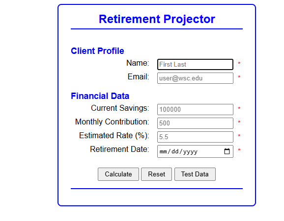
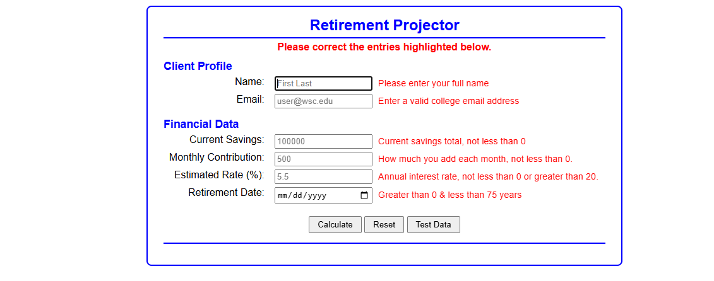
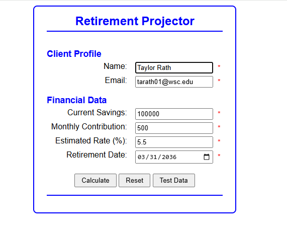

# Retirement Countdown

<b> Table of Contents </b>

- [Summary](#summary)
- [New Concepts](#new-concepts)
- [Screenshots](#screenshots)
  - [Main Page](#main-page)
  - [Validation](#validation)
  - [Test Data](#test-data)
  - [Calculated](#calculate)
  - [Completed](#completed)
- [Maintainers](#maintainers)
------------------------------------

### Summary
This program collects your information to calculate a countdown for your retirement. 
Providing your Name, Email, Current Savings, Monthly Contribution, Estimated Rate Percentage, and lastly
your Retirement Date. Using this information that you've provided, you will then be able to 
calculate when you will be able to retire.  

Use this program as a fun way to determine when you'll be able to end working and let the fun in life begin!

---------------
## New Concepts
- Date and Timer Logic
- Handling Data Validation using JavaScript instead of HTML attributes
- Retrieving user's previous valid entries using localStorage
- $ element
- getFullYear
- Try-Catch
- Formation
--------------
## Screenshots

--------
### Main Page

------
### Validation

------------
### Test Data

------
### Calculate

----------
### Completed

--------
### Maintainers
[@tarath01](https://github.com/tarath01/CH89_Retirement) Taylor Rath  

--------------
[Back to the Top](#retirement-countdown)